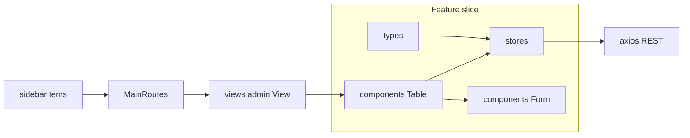

# Vertical feature slice (Jack Henry admin CRUD)

This guide describes how to add a **vertical feature slice**: colocated domain types, a Pinia store, and Vue components under `src/features/jack-henry/<domain-kebab>/`, plus a thin **page** in `src/views/admin/`, **routing**, and **sidebar** navigation.

The **reference implementation** is **Job Titles**. Use it when copying structure and conventions.

## Reference files (Job Titles)

| Layer | Path |
|--------|------|
| Types | [`src/features/jack-henry/job-titles/types/JobTitle.ts`](../src/features/jack-henry/job-titles/types/JobTitle.ts) |
| Store | [`src/features/jack-henry/job-titles/stores/jobTitleStore.ts`](../src/features/jack-henry/job-titles/stores/jobTitleStore.ts) |
| Form (dialog CRUD UI) | [`src/features/jack-henry/job-titles/components/JobTitleForm.vue`](../src/features/jack-henry/job-titles/components/JobTitleForm.vue) |
| Table (list + wiring) | [`src/features/jack-henry/job-titles/components/JobTitleTable.vue`](../src/features/jack-henry/job-titles/components/JobTitleTable.vue) |
| Page shell | [`src/views/admin/JobTitlesView.vue`](../src/views/admin/JobTitlesView.vue) |
| Route | [`src/router/MainRoutes.ts`](../src/router/MainRoutes.ts) (admin block: `name`, `path`, lazy `component`) |
| Sidebar | [`src/layouts/full/vertical-sidebar/sidebarItems.ts`](../src/layouts/full/vertical-sidebar/sidebarItems.ts) (`Admin` → `children`) |

### Shared infrastructure

- **HTTP**: [`src/utils/axios.ts`](../src/utils/axios.ts) — `VITE_API_URL` as base URL, Bearer token from `localStorage`, 401 handling.
- **Select options**: [`src/types/SelectOption.ts`](../src/types/SelectOption.ts) — `SelectOption<T>` for `v-combobox` / `v-select` items.
- **Delete confirmation**: `@/utils/helpers/useConfirm` — pattern used in `JobTitleTable.vue` before destructive actions.

### Architecture (data flow)



---

## 1. Naming conventions

| What | Convention | Example |
|------|------------|---------|
| Feature folder | kebab-case | `job-titles` |
| Vue components | PascalCase | `JobTitleForm.vue`, `JobTitleTable.vue` |
| Store file | camelCase | `jobTitleStore.ts` |
| Type file | PascalCase (optional) | `JobTitle.ts` |
| Pinia store id | Short, domain-shaped string | `'jobTitles'` |
| Composable | `use` + PascalCase entity + `Store` | `useJobTitleStore` |

Keep naming aligned with sibling features (for example [`PayGradesView.vue`](../src/views/admin/PayGradesView.vue) and its feature folder).

---

## 2. Types (`types/<Entity>.ts`)

- Define the **entity interface**, including `id` when the API returns one.
- Add **DTOs** for create/update, typically `Omit<..., 'id'>` or type aliases as in Job Title (`CreateJobTitleDto`, `UpdateJobTitleDto`).
- Place **domain-specific unions** (enums-as-unions) next to the entity (for example `ExemptionStatus`).

See [`JobTitle.ts`](../src/features/jack-henry/job-titles/types/JobTitle.ts).

---

## 3. Store (`stores/<entity>Store.ts`)

- Use **`defineStore`** with the **composition API** (`setup` style): `ref` for `items` array, `loading`, and `error`.
- Declare a **REST path constant** at the top (for example `const jobTitlesPath = '/job-titles'`). It **must match the backend** (usually kebab-case plural).
- Implement:
  - **`fetch...`** — `GET` collection; populate the list; handle errors.
  - **`get...` (optional)** — `GET` by id; optionally merge into local list if missing.
  - **`create...`** — `POST`; append returned entity to the list.
  - **`update...`** — `PUT`; replace or append in the list.
  - **`delete...`** — `DELETE`; remove from local list.
  - **`clearError`** — reset `error` for UI (for example when closing a dialog).
- Import **`axios`** from `@/utils/axios` (default export).
- Use **`isAxiosError`** and a small **`setErrorMessage`** helper so users see `response?.data?.message` when present, with a sensible fallback string.

See [`jobTitleStore.ts`](../src/features/jack-henry/job-titles/stores/jobTitleStore.ts).

---

## 4. Components

### Form (`components/<Entity>Form.vue`)

Typical responsibilities:

- **`v-dialog`** wrapping create/edit UI; activator button for “Add …” if applicable.
- **Props**: `saving`, `error` (string \| null), optional `submitDisabled`.
- **Emits**: `submit` with a typed payload (include optional `id` for edit), `cancel`.
- **`defineExpose({ openCreate, openEdit, close })`** so the table can open edit mode and close after success.
- Local **`canSave`** / validation before emit; trim strings as needed.
- If the form references **other entities** (Job Titles uses pay grades and job families), call those stores’ fetch methods in **`onMounted`** when caches are empty—keep **dependencies one-way** (this feature may depend on others; avoid circular store imports).

See [`JobTitleForm.vue`](../src/features/jack-henry/job-titles/components/JobTitleForm.vue).

### Table (`components/<Entity>Table.vue`)

Typical responsibilities:

- **`onMounted`**: fetch the primary list; optionally fetch related stores for labels or filters.
- **`ref`** to the Form component; **`editItem`** calls `openEdit(row)` on the form ref.
- **`save`**: branch on payload `id` — **`update`** vs **`create`**; set **`saving`**; on success and no store error, **`close()`** the form.
- **`deleteItem`**: **`useConfirm`**; then call store **`delete`**; track **`deleting`** if you disable UI during delete.
- **`computed`** for filtered rows (search), and maps from related ids to display labels when needed.
- **`isBusy`**: combine loading/saving/deleting/store.loading for disabling actions.
- Template: search row, form slot, **`v-table`** (or project-standard table) with loading and empty states; optional **scoped CSS** class for column widths.

See [`JobTitleTable.vue`](../src/features/jack-henry/job-titles/components/JobTitleTable.vue).

---

## 5. Admin view (`src/views/admin/<Feature>View.vue`)

Keep the page **thin**: a `v-card`, page title, and a single table component—same pattern as [`JobTitlesView.vue`](../src/views/admin/JobTitlesView.vue).

---

## 6. Router (`src/router/MainRoutes.ts`)

Under `MainRoutes.children`, add a child next to other **`/admin/*`** routes:

- **`name`**: human-readable route name (for example `'Job Titles'`).
- **`path`**: absolute path (for example `'/admin/job-titles'`).
- **`component`**: lazy import — `() => import('@/views/admin/<Feature>View.vue')`.

---

## 7. Sidebar (`src/layouts/full/vertical-sidebar/sidebarItems.ts`)

Under the **Admin** item’s **`children`** array, add:

```ts
{
    title: 'Job Titles',
    to: '/admin/job-titles'
}
```

Match **`title`** and **`to`** to the route’s display name and path.

---

## 8. Optional variations

- **Related entities**: Import other feature stores only where the UI needs them; prefer **fetch-on-demand** in the form/table when caches are empty (see Job Titles + Pay Grades + Job Families).
- **Non-admin features**: Use a different path prefix (for example `/staff/...`) and add or reuse an appropriate **sidebar** section (compare **Staff** vs **Admin** in [`sidebarItems.ts`](../src/layouts/full/vertical-sidebar/sidebarItems.ts)).

---

## 9. Verification checklist

1. **`VITE_API_URL`** (or default `/`) is correct for the environment; REST paths match the API.
2. Types compile; store methods mirror backend contracts.
3. Create, edit, delete, and list behave end-to-end with loading and error states.
4. Route loads under **`FullLayout`** with auth **`requiresAuth`** as for sibling admin routes.
5. Sidebar entry navigates to the new page.
